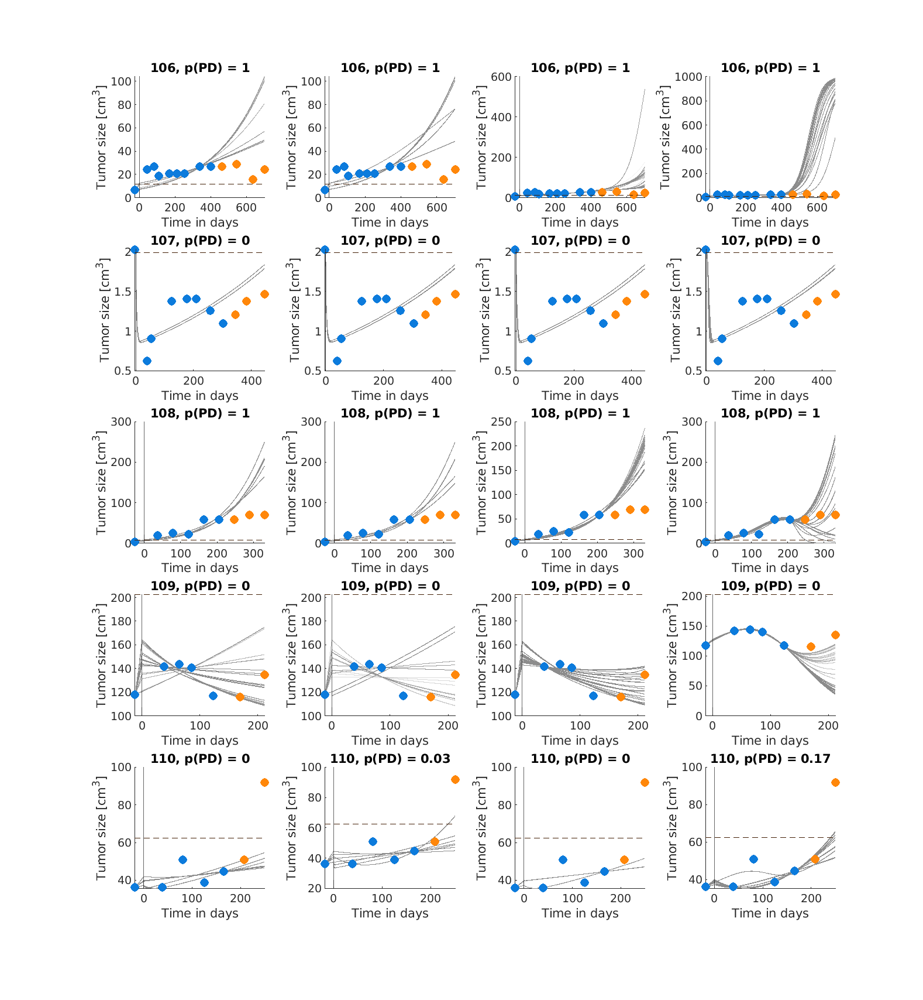

# Prediction Performance (OAK Study)

Prediction performance for the patients presented analogously to Figure 7 in the paper.

  
  
  
  
  
  
  
  
  
  
  
  
  
  
  
  
  
  
  
  
  
  
  
  
  
  
  
  
  
  
  

