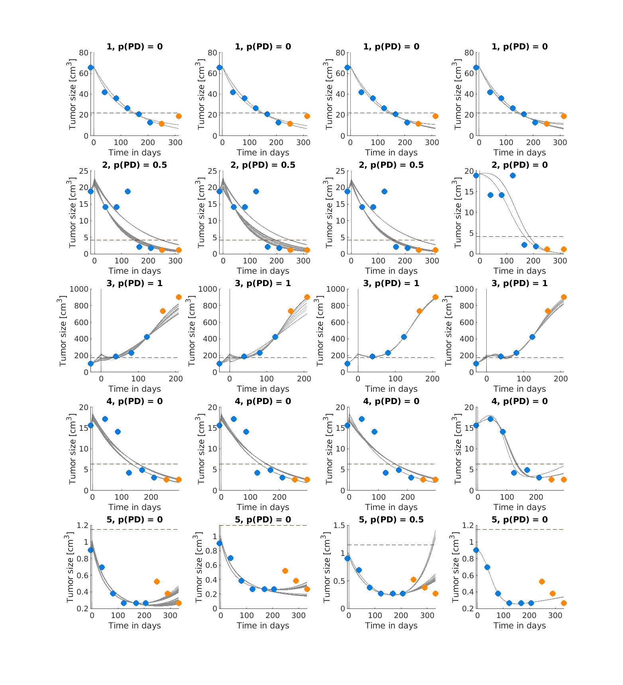
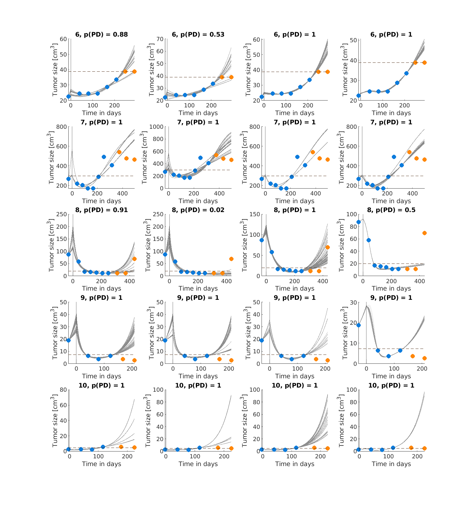
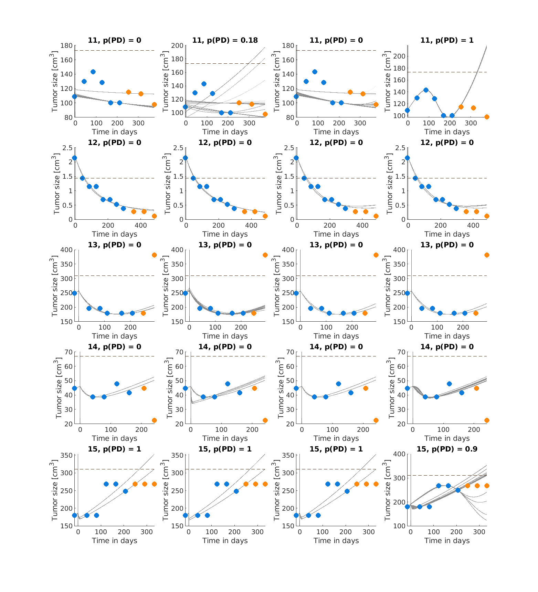
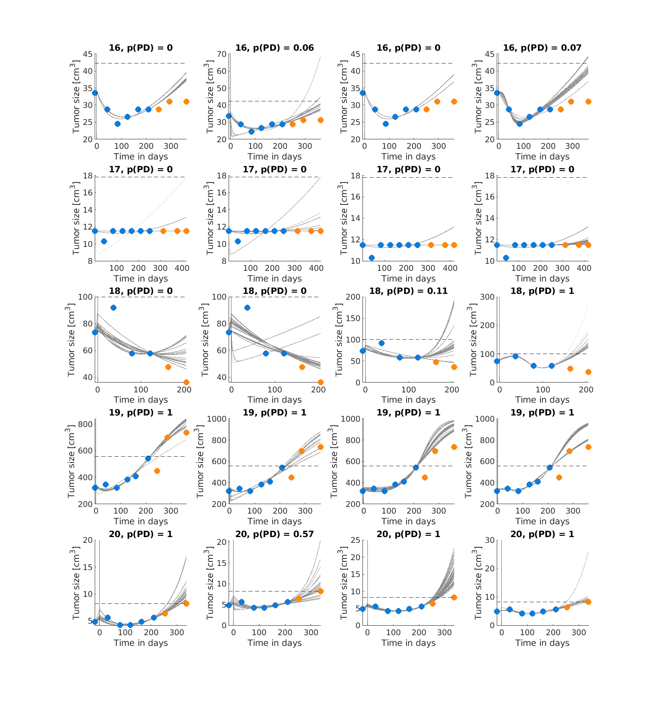
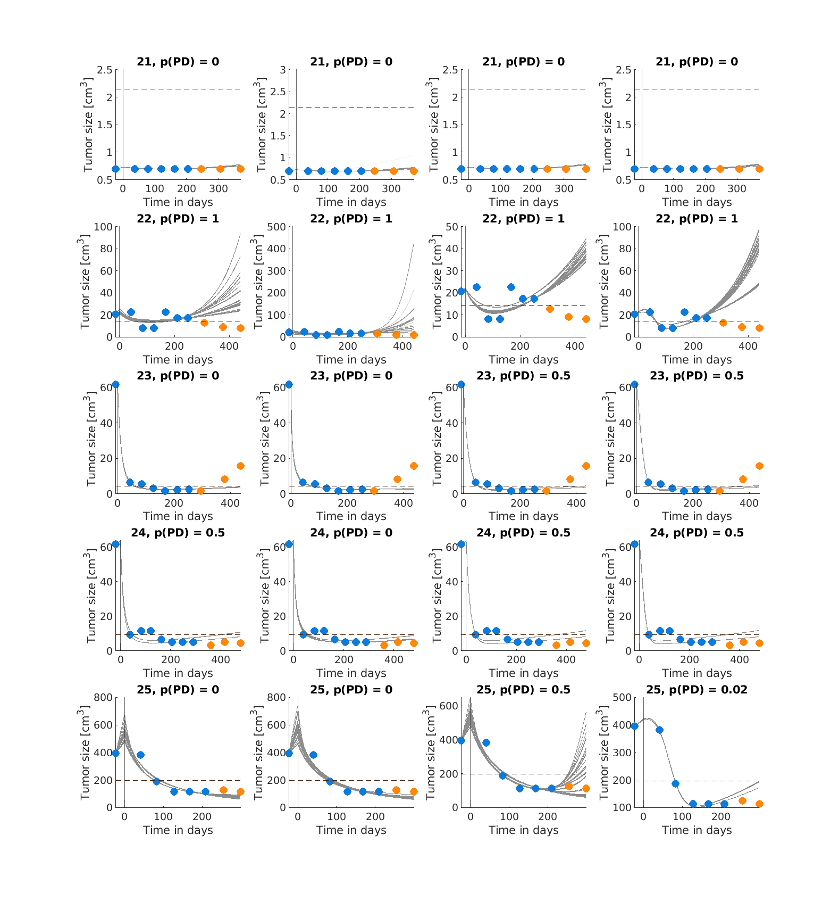
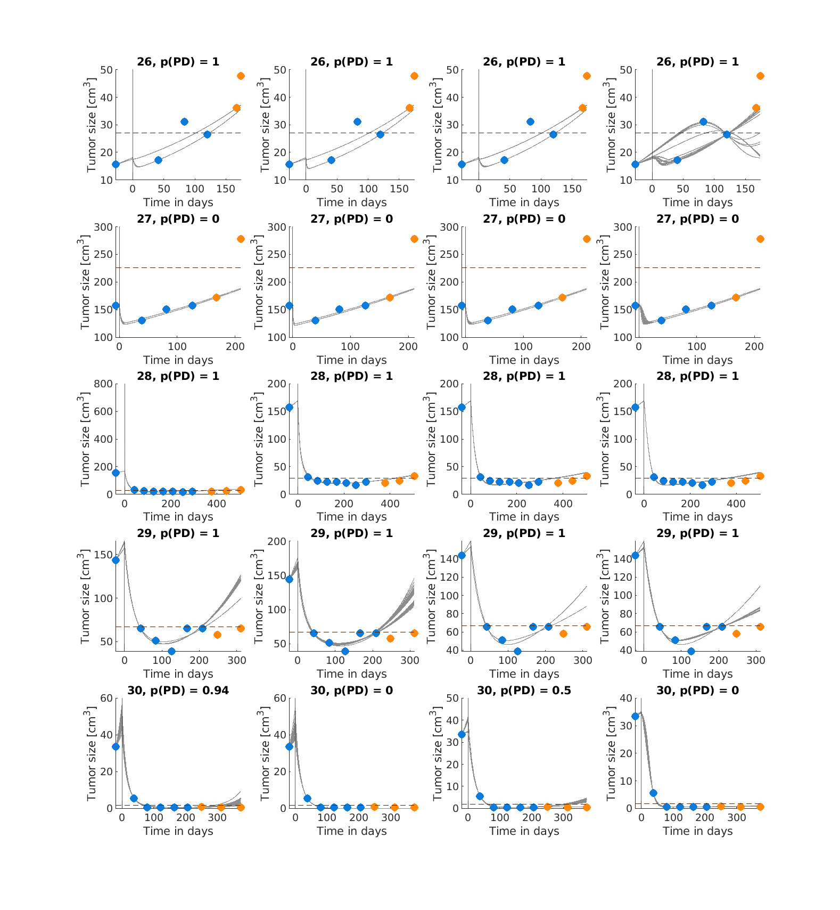
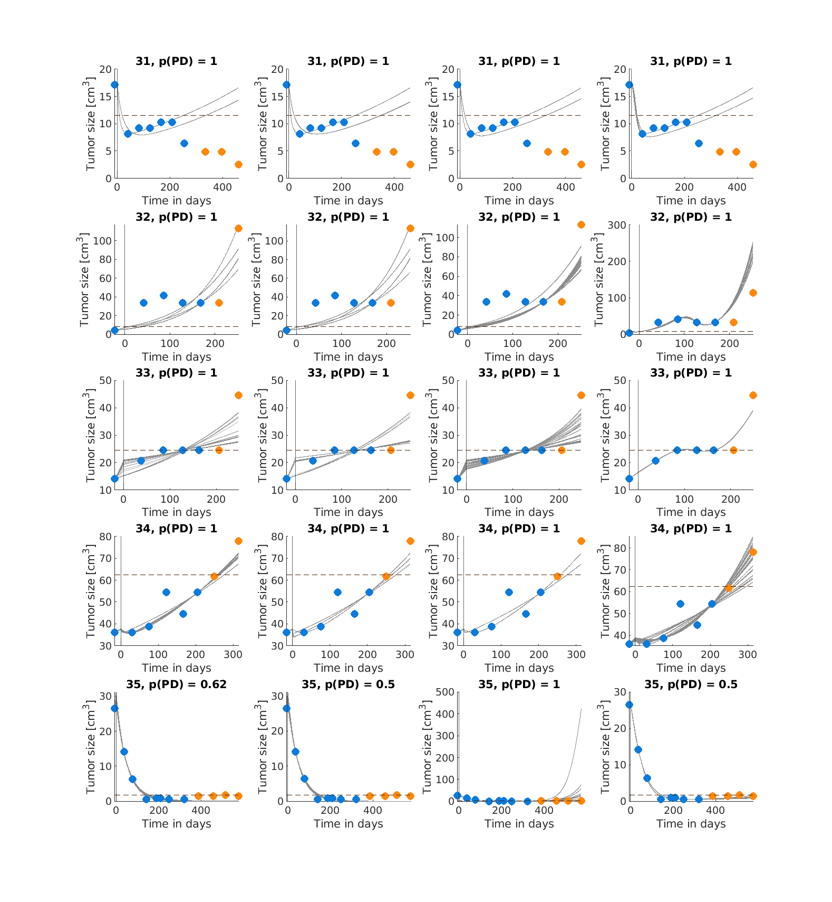
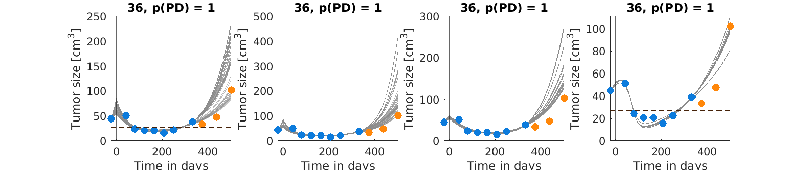

# Prediction Performance (POPLAR Study)

Prediction performance for the patients presented analogously to Figure 7 in the paper. See the tables below for exact computed PD probabilities and confusion matrices.

  
  
  
  
  
  
  
  

In the table below, we report the following information for each patient seen above: the patient ID, the Ground Truth (GT) progressive disease outcome, the model-derived ensemble probability (rounded), the classification outcome, and whether the ensemble was fully certain of its outcome.

| ID | GT | Ensemble Probability | Classification Outcome | Fully Certain? |
| :---: | :---: | :---: | :---: | :---: |
| 1 | 0 | 0 | TN | true |
| 2 | 0 | 0.375 | TN | false |
| 3 | 1 | 1 | TP | true |
| 4 | 0 | 0 | TN | true |
| 5 | 0 | 0.125 | TN | false |
| 6 | 1 | 0.854 | TP | false |
| 7 | 1 | 1 | TP | true |
| 8 | 1 | 0.609 | TP | false |
| 9 | 0 | 1 | FP | true |
| 10 | 1 | 1 | TP | true |
| 11 | 0 | 0.295 | TN | false |
| 12 | 0 | 0 | TN | true |
| 13 | 1 | 0 | FN | true |
| 14 | 0 | 0 | TN | true |
| 15 | 0 | 0.974 | FP | false |
| 16 | 0 | 0.032 | TN | false |
| 17 | 0 | 0 | TN | true |
| 18 | 0 | 0.278 | TN | false |
| 19 | 1 | 1 | TP | true |
| 20 | 1 | 0.892 | TP | false |
| 21 | 0 | 0 | TN | false |
| 22 | 1 | 1 | TP | true |
| 23 | 1 | 0.25 | FN | false |
| 24 | 0 | 0.375 | TN | false |
| 25 | 0 | 0.131 | TN | false |
| 26 | 1 | 1 | TP | true |
| 27 | 1 | 0 | FN | true |
| 28 | 1 | 1 | TP | true |
| 29 | 0 | 1 | FP | true |
| 30 | 0 | 0.359 | TN | false |
| 31 | 0 | 1 | FP | true |
| 32 | 1 | 1 | TP | true |
| 33 | 1 | 1 | TP | true |
| 34 | 1 | 1 | TP | true |
| 35 | 1 | 0.655 | TP | false |
| 36 | 1 | 1 | TP | true |

With the above computations, we obtain the following confusion matrices (considering all patients, and only the ones with full certainty, respectively):

|   | P | N |
|---|----|----|
| PP | 15 | 4 |
| PN | 3 | 14 |

|   | P | N |
|---|----|----|
| PP | 11 | 3 |
| PN | 2 | 5 |
